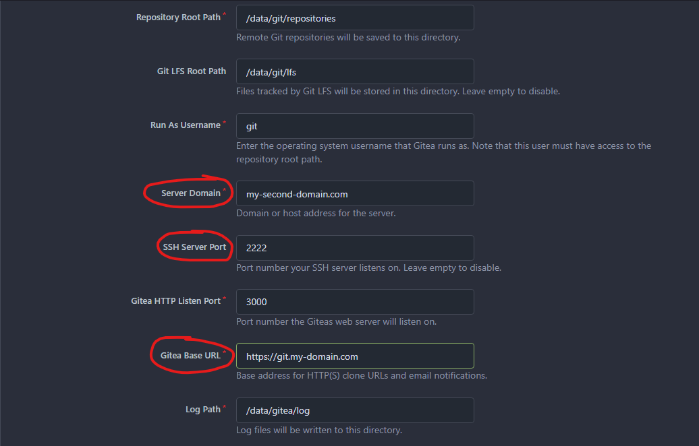
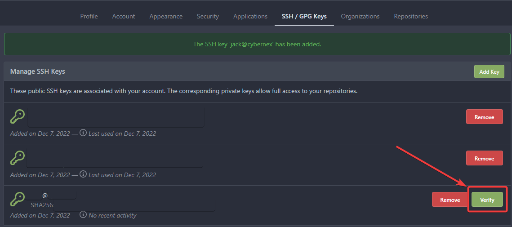
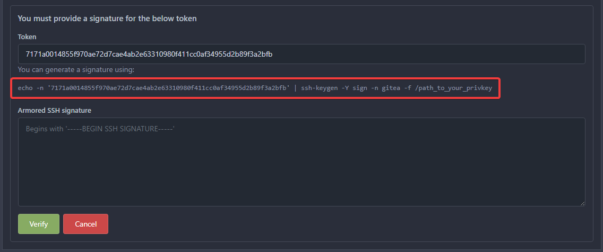
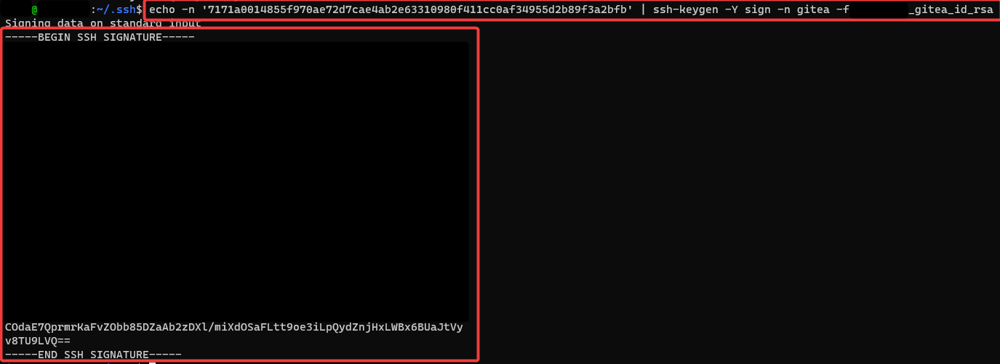

# Setup

Create empty `data` and `ssh` dirs in the same directory as `docker-compose.yml`. Copy `.env.example` to `.env`, update any env variables. Run `$ docker-compose up -d`.

# Links & Notes

## Notes

* The host & container SSH port cannot be the same
    * My host uses port `22` for SSH traffic
    * I had to set the container to use port `2222:22` for SSH to work
* The web interface (default port `3000`) and SSH clone URL needed to be different
    * I used `git.my-domain.com` (for example) as the web URL
        * This URL is proxied with `nginx-proxy-manager` in my setup to resolve to the container's web interface
    * I used a separate domain entirely, i.e. `my-second-domain.com`, for SSH
        * The HTTP clone URL uses `git.my-domain.com`
        * The SSH clone URL uses `my-second-domain.com` via port `2222`, using the SSH key I added to the Gitea instance
        * I hosted this service at home, and needed to forward port `2222` to the container host
    * My SSH config looks like:
```
Host my-second-domain.com
    HostName my-second-domain.com
    User git
    IdentityFile ~/.ssh/my_gitea_id_rsa
    Port 2222
```

* This is what my initial `Gitea` config looks like on the web:



**Adding SSH keys to Gitea**

* Create a new key
    * `$ cd ~/.ssh && ssh-keygen -t rsa -b 4096`
    * (optional) name the key <host>_gitea_id_rsa
* `cat` the public key
    * `$ cat ~/.ssh/key_from_last_step.pub`
* Add the key to Gitea (in settings)
* Verify the key
    * Click the Verify button
    
    * Copy the SSH key verification command and run on the local machine
    
    * Copy the generated certificate & paste back into Gitea
    

## Links

- [TechAddressed: SELF HOSTING YOUR OWN GITEA SERVER USING DOCKER](https://www.techaddressed.com/tutorials/hosting-gitea-using-docker/)
    -  This guide helped me get the server running