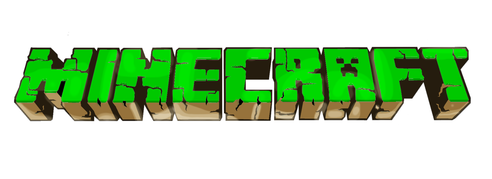

# Docker Minecraft Server <!-- omit in toc -->

<!-- Repo image -->
<p align="center">
  <a href="https://github.com/redjax/docker_templates">
    <picture>
      <source media="(prefers-color-scheme: dark)" srcset="./minecraft-logo-1015.png">
      
    </picture>
  </a>
</p>

Dockerized Minecraft server.

The [itz/minecraft-server container](https://hub.docker.com/r/itzg/minecraft-server) is a highly configurable server environment that supports vanilla server creation or modded with Fabric, Spiget, etc.

```
WARNING: This path is undergoing active development.

Consider this template unstable until this message is reviewed.
```

## Table of Contents

- [Table of Contents](#table-of-contents)
- [Usage](#usage)
  - [Env setup](#env-setup)
  - [Player whitelist.json](#player-whitelistjson)
  - [Modded server](#modded-server)
- [Using RCON to be a dirty cheater or server admin](#using-rcon-to-be-a-dirty-cheater-or-server-admin)
  - [Spawning items](#spawning-items)
- [Manage multiple Minecraft installations with Prism](#manage-multiple-minecraft-installations-with-prism)
- [Links](#links)
  - [General](#general)
  - [Tools/Utilities](#toolsutilities)
  - [Guides/Tutorials](#guidestutorials)
  - [Skins](#skins)
  - [Maps/Seeds](#mapsseeds)
  - [Mods/Plugins](#modsplugins)

## Usage

There are multiple ways to run this Dockerized Minecraft server container. You can copy the example files like [`.env.example`](./.env.example) and [`./whitelist.example.json`](./whitelist.example.json) and run the [`compose.yml` file](./compose.yml) directly from this git repository. Using this method, you will run 1 server at a time.

You can also copy the entire [`../docker_minecraft_server`](../docker_minecraft_server/) to another path on your filesystem, outside of the `docker_templates/` repository clone. You can edit the environment and whitelist files at that path, and create multiple isolated Minecraft servers this way. Any changes made in this repository template will need to be manually applied to your detached Minecraft servers.

### Env setup

Copy [`.env.example`](./.env.example) to `.env`. Edit it to your liking, or leave the defaults.

**TODO**: Write documentation for using [`env_file`s](./envs).

### Player whitelist.json

You can add players to a [`whitelist.json`] file before starting your server if you know their username and UUID. You can use [mcuuid.net](https://mcuuid.net) to look up a player's UUID by username or username by UUID.

When using a whitelist, you need to set `MC_SERV_WHITELIST_ENABLED=true` in the [`.env` file](./.env.example).

Create a `whitelist.json` by copying [`whitelist.example.json`](./whitelist.example.json) to `whitelist.json`.

A valid `whitelist.json` looks like this (replace the default values with your own, copy/paste `{key/value pairs}` for as many players you will allow to connect):

```json
[
    {
        "uuid": "xxxxxxxx-xxxx-xxxx-xxxx-xxxxxxxxxxxx",
        "name": "username"
    },
    {
        "uuid": "xxxxxxxx-xxxx-xxxx-xxxx-xxxxxxxxxxxx",
        "name": "username"
    }
]
```

When using a whitelist, you need to edit the [`compose.yml` file](./compose.yml); uncomment the `# - ${MC_SERVER_WHITELIST_FILE:-./whitelist.json}:/extra/whitelist.json` line.

### Modded server

*[`minecraft-server` Docs: Working with mods and plugins](https://docker-minecraft-server.readthedocs.io/en/latest/mods-and-plugins/)* | 
*[`minecraft-server` Docs: Server types and modpack platforms](https://docker-minecraft-server.readthedocs.io/en/latest/types-and-platforms/)*

Set the [`TYPE=<mod-manager>` environment variable](https://docker-minecraft-server.readthedocs.io/en/latest/types-and-platforms/) in your [`.env` file](./.env.example) to one of the following:

| .env `TYPE=` | Description |
| ------ | ----------- |
| [`VANILLA`](https://docker-minecraft-server.readthedocs.io/en/latest/types-and-platforms/) | The default, vanilla Minecraft server provided by Mojang. |
| [`AUTO_CURSEFORGE`](https://docker-minecraft-server.readthedocs.io/en/latest/types-and-platforms/mod-platforms/auto-curseforge/) | Automated Curse Forge modpacks, keeping everything automatically updated. |
| [`CURSEFORGE`](https://docker-minecraft-server.readthedocs.io/en/latest/types-and-platforms/mod-platforms/curseforge/) | A manual Curse Forge server. "Manual" means you are responsible for downloading & updating the mods. |
| [`FTBA`](https://docker-minecraft-server.readthedocs.io/en/latest/types-and-platforms/mod-platforms/ftb/) |  FeedTheBeast modpacks support. |
| [`MODRINTH`](https://docker-minecraft-server.readthedocs.io/en/latest/types-and-platforms/mod-platforms/modrinth-modpacks/)  | Manage mods with [Modrinth](https://modrinth.com) |
| [`FABRIC`](https://docker-minecraft-server.readthedocs.io/en/latest/types-and-platforms/server-types/fabric/) | Manage mods with a [Fabric server](https://fabricmc.net/) |
| [`FORGE`](https://docker-minecraft-server.readthedocs.io/en/latest/types-and-platforms/server-types/forge/) | Manage mods with a [Forge server](http://www.minecraftforge.net/) |
| [`QUILT`](https://docker-minecraft-server.readthedocs.io/en/latest/types-and-platforms/server-types/quilt/) | Manage mods with a [Quilt server](https://quiltmc.org/) |

Note that some of the `TYPE` values can take other values, like if `TYPE="QUILT"`, you can set `QUILT_LOADER_VERSION=...` and `QUILT_INSTALLER_VERSION=...`.

## Using RCON to be a dirty cheater or server admin

Start an RCON session with `docker compose exec -it mc-server rcon-cli`. You can also run a command directly, like `docker compose exec -it mc-server say "Hello to the whole server!"`.

### Spawning items

I use an `rcon-cli` command generator to "build" `/give` commands. Some options are:

- [gamergeeks.net](https://www.gamergeeks.net/apps/minecraft/give-command-generator)
- [nixinova.com](https://www.nixinova.com/tools/minecraft/commands/give)

Some examples:

| Command | Description |
| ------- | ----------- |
| `give /@ torch 64` | Give all players (`/@`) 64 torches. |
| `give <player_name> torch 1` | Give a player 1 torch (use in-game name for `<player_name>`). |
| `give @a diamond_pickaxe[enchantments={levels:{efficiency:5,fortune:3,unbreaking:3}},unbreakable={}]` | Give everyone a ridiculously OP pickaxe. |
| `give @a diamond_axe[enchantments={levels:{efficiency:5,fortune:3,unbreaking:3}},unbreakable={}]` | Give everyone a ridiculously OP axe. |
| `give @a diamond_shovel[enchantments={levels:{efficiency:5,fortune:3,unbreaking:3}},unbreakable={}]` | Give everyone a ridiculously OP shovel. |

## Manage multiple Minecraft installations with Prism

The [Prism launcher](https://prismlauncher.org) can manage multiple Minecraft instances, accounts, & mods. When spinning up multiple different kinds of modded servers, Prism can help you maintain separate installs & configurations for your Minecraft client.

Check [their Github](https://github.com/PrismLauncher/PrismLauncher/) for downloads & links to documentation.

## Links

### General

- [Docker Hub: itzg/minecraft-server](https://hub.docker.com/r/itzg/minecraft-server)
- [Github: itzg/minecraft-server](https://github.com/itzg/docker-mc-backup)
- [itzg/minecraft-server Docs](https://docker-minecraft-server.readthedocs.io/en/latest/)
- [Blog: Minecraft Server in Docker: Adulting Made Easy](https://serialized.net/2021/02/minecraft_server_docker/)
- [Github: jbarratt/docker-homelab](https://github.com/jbarratt/docker-homelab/blob/main/minecraft.yml)
- [Github: itzg/docker-mc-backup](https://github.com/itzg/docker-mc-backup)
- [Official Minecraft wiki](https://minecraft.wiki/w/Tutorial)
- [itzg/minecraft-server docs: environment variables](https://docker-minecraft-server.readthedocs.io/en/latest/variables/#general-options)

### Tools/Utilities

- [Minecraft object ID lookup](https://minecraft-ids.grahamedgecombe.com)
- [chunkbase.com: seed chunk explorer](https://www.chunkbase.com/apps/)
- [potioncraft.net](https://potioncraft.net)
- [minecraft.tools](https://minecraft.tools/en/)
- [UUID/username lookup: mcuuid.net](https://mcuuid.net) (find a player's username/UUID for your `whitelist.json`)
- [rcon command generator: gamergeeks.net](https://www.gamergeeks.net/apps/minecraft/give-command-generator)
- [rcon command generator: nixinova.com](https://www.nixinova.com/tools/minecraft/commands/give)
- [Nether portal calculator: minefort.com](https://minefort.com/tools/nether-portal-calculator)
- [Nether portal calculator: nethercalculator.com](https://nethercalculator.com)
- [Modeller: plotz.co.uk](https://www.plotz.co.uk)
- [Crafting: minecraft-crafting.net](https://www.minecraft-crafting.net)

### Guides/Tutorials

- [mentalblockgaming.com: Comprehensive introduction to redstone](https://mentalblockgaming.com/blog/redstone/walking-before-you-run-a-comprehensive-introduction-to-redstone/)

### Skins

- [namemc.com](https://namemc.com)
- [minecraftskins.com](https://www.minecraftskins.com)
- [planetminecraft.com](https://www.planetminecraft.com/skins/)
- [minecraftskins.net](https://www.minecraftskins.net)
- [skinmc.net](https://skinmc.net/skins)
- [tynker.com](https://www.tynker.com/minecraft/skins/)
- [Custom heads: freshcoal.com](https://freshcoal.com/maincollection)
- [Custom heads: minecraft-heads.com](https://minecraft-heads.com)

### Maps/Seeds

- [minecraftmaps.com](https://www.minecraftmaps.com)
- [minecraft-seeds.net](https://minecraft-seeds.net)

### Mods/Plugins

  - https://www.minecraftmods.com
